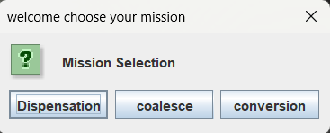
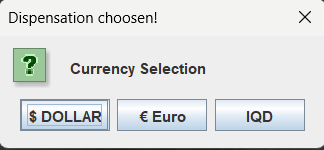
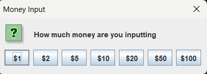
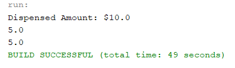
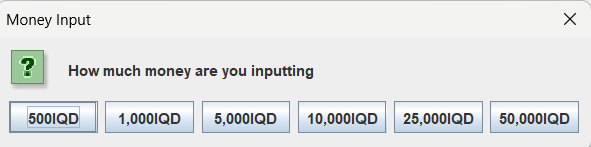
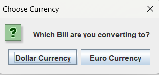
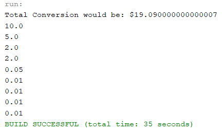

# Money-Exchange-System 🏧💵
An ATM System that Dispenses, Coalesces, and Convert's money between different currencies built using Java.

## Features
- Dispensing money in three different currencies (IQD, Dollar, Euro).
- Coalescing money in three different currencies (IQD, Dollar, Euro).
- Converting money between the different currencies (IQD, Dollar, Euro).

## Technologies
- Java.
- Javax package.
- OOP.

## Screenshots

## How to run the system
1. Clone the repository.
2. Open the project in a IDE (Netbeans prefered).
3. Run the project in the IDE.
